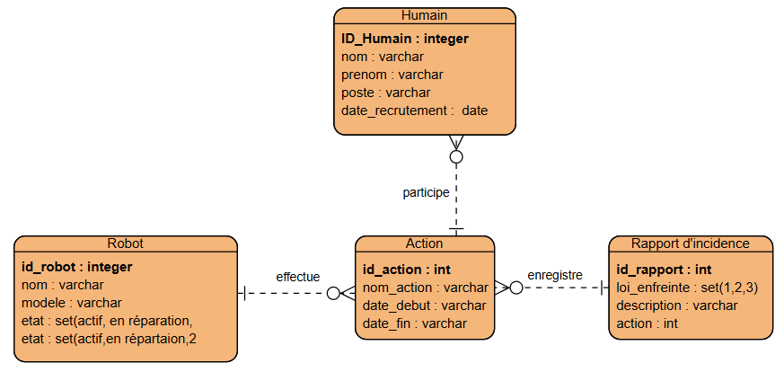

### Projets de la base de donnée (BDD) de control desrobots de la colonie
### 
###

  
  #### notre moddelisation avec un diagram entité realtion MCD
  
  
  
  #### MLD
  Humain(<ins>ID_humain</ins> ,nom,poste,date_recrutement)  
  Robot(<ins>id_robot</ins>,nom,modele,etat)  
  Action(<ins>id_action</ins>,description,date_debut,date_fin)  
  RapportIncidence(<ins>id_rapport</ins>,typeViolation,description,loiViole,#action_id_action)  
  ParticipationRobot(<ins>#robot_id_robot</ins>,<ins>#action_id_action</ins>)  
  ParticipationHumain(<ins>#robot_id_humain</ins>,<ins>#action_id_action</ins>)  
  
  #### notre base de donnée finale
  

