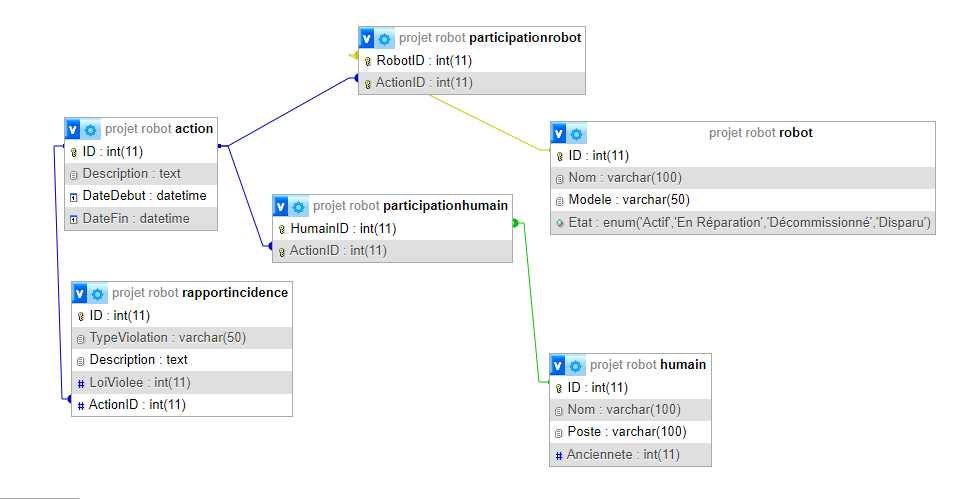

###Projets de la base de donnée (BDD) de control desrobots de la colonie
### 
###

  ### notre moddelisation avec un diagram entité realtion MCD
  
  ###
  ### MLD
  
  ### notre base de donnée finale
  

